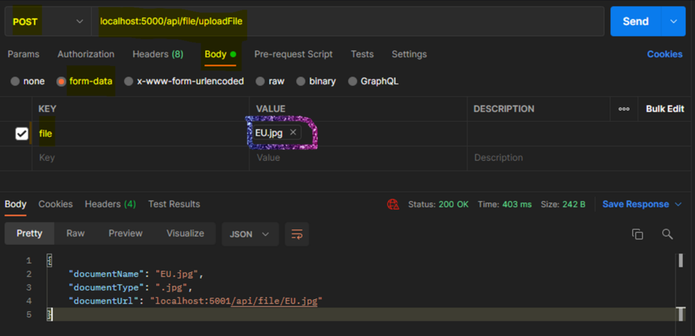
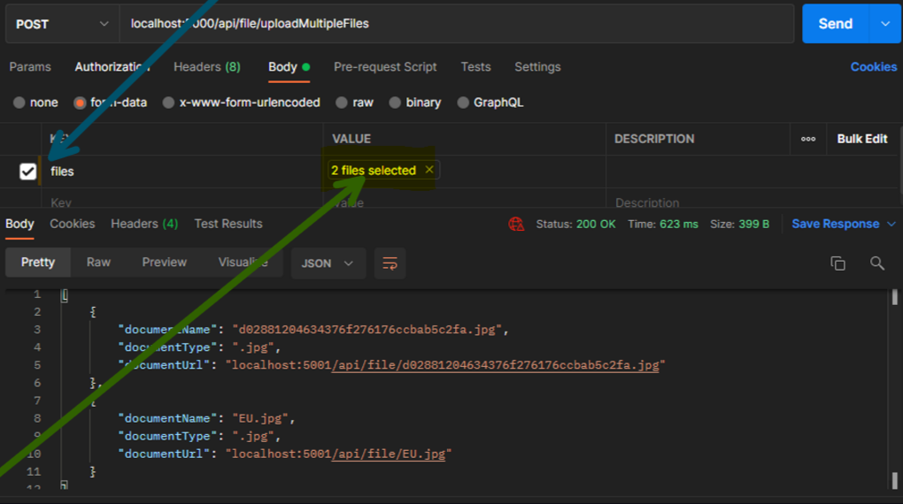

# Upload e Download de Arquivos

Neste repositório implementamos uma **WEBAPI** que suporta *upload* de arquivos (simples e múltiplos arquivos) e também o *download*. 

Criador por **Ellison W. M. Guimarães**

**LinkedIn**: https://www.linkedin.com/in/ellisonguimaraes/

**E-mail**: [ellison.guimaraes@gmail.com](mailto:ellison.guimaraes@gmail.com)

Para exemplificar o *upload* e *download* de arquivos, precisamos inicialmente definir a classe de serviço. Essa classe de serviço servirá para armazenar ou solicitar um arquivo de um diretório. 

A estrutura do nosso projeto fica da seguinte forma: 


> Guardaremos os arquivos de *upload* dentro da pasta **Upload** criada no diretório raiz do projeto.


# 1. Criando a classe de Serviço: FileServices

Para criar a classe de serviço, iremos inicialmente definir uma interface, a `IFileServices`:

```C#
using System.Collections.Generic;
using System.Threading.Tasks;
using FilesProject.Models;
using Microsoft.AspNetCore.Http;

namespace FilesProject.Services
{
    public interface IFileServices
    {
        public byte[] GetFile(string filename);
        public Task<FileDetailDTO> UploadFile(IFormFile file);
        public Task<List<FileDetailDTO>> UploadManyFiles(IList<IFormFile> files);
    }
}
```

O método que implementar a interface assinará três métodos:

- O método `GetFile`: recebe uma *string* contendo o nome do arquivo e retorna um *array* de `byte`. Em código, esse *array* de `byte` é a imagem requisitada;
- O método `UploadFile`: recebe um objeto do tipo `IFormFile` que trata-se da imagem recebida no **POST** do *client*, e retorna um objeto do tipo `FileDetailDTO` que são as informações da imagem do *upload* feito; 
- O método `UploadManyFiles`: recebe uma lista de `IFormFile`, ou seja, uma lista de arquivos (vários arquivos) e também retorna uma lista de `FileDetailDTO` com as informações de cada imagem do *upload*.

Antes de irmos para a implementação da interface, vamos analisar um pouco sobre o **DTO** `FileDetailDTO`: 

```C#
namespace FilesProject.Models
{
    public class FileDetailDTO
    {
        public string DocumentName { get; set; }
        public string DocumentType { get; set; }
        public string DocumentUrl { get; set; }
    }
}
```

Na classe temos os seguintes atributos:

- `DocumentName` que armazena o nome do arquivo. Por exemplo: ==EU.jpg==;
- `DocumentType` que armazena o tipo/extensão do arquivo. Por exemplo, usando o caso acima seria: ==.jpg==;
- `DocumentUrl` que armazena a URL para acesso ao arquivo através do `GetFile`. Exemplo: ==localhost:5001/api/file/EU.jpg==.

 Agora vamos para a implementação da interface `IFileServices`, a `FileServices`:

```C#
using System.IO;
using System.Collections.Generic;
using System.Threading.Tasks;
using FilesProject.Models;
using Microsoft.AspNetCore.Http;

namespace FilesProject.Services
{
    public class FileServices : IFileServices
    {
        private readonly string _basePath;
        private readonly IHttpContextAccessor _context;

        public FileServices(IHttpContextAccessor context)
        {
            _context = context;
            _basePath = Directory.GetCurrentDirectory() + "\\Upload\\";
        }

        public async Task<FileDetailDTO> UploadFile(IFormFile file)
        {
            FileDetailDTO fileDetail = new FileDetailDTO();

            var fileType = Path.GetExtension(file.FileName);
            var baseUrl = _context.HttpContext.Request.Host;

            if (fileType.ToLower() == ".pdf" ||
                fileType.ToLower() == ".jpg" ||
                fileType.ToLower() == ".png" ||
                fileType.ToLower() == ".jpeg" )
            {
                var docName = Path.GetFileName(file.FileName);
                
                if (file != null && file.Length > 0)
                {
                    var destination = Path.Combine(_basePath, "", docName); 
                    
                    fileDetail.DocumentName = docName;
                    fileDetail.DocumentType = fileType;
                    fileDetail.DocumentUrl = Path.Combine(baseUrl 
                                                          + "/api/file/" 
                                                          + fileDetail.DocumentName);
                    
                    // Abrimos um stream criando o arquivo 
                    using var stream = new FileStream(destination, FileMode.Create);

                    // Copiamos o conteúdo de file para a stream
                    await file.CopyToAsync(stream);
                }
            }

            return fileDetail;
        }

        public async Task<List<FileDetailDTO>> UploadManyFiles(IList<IFormFile> files)
        {
            List<FileDetailDTO> filesDetail = new List<FileDetailDTO>();

            foreach(var file in files)
                filesDetail.Add(await UploadFile(file));

            return filesDetail;
        }

        public byte[] GetFile(string filename)
        {
            var filePath = _basePath + filename;
            return File.ReadAllBytes(filePath);
        }   
    }
}
```

Vamos fazer algumas observações gerais da classe:

- Inicialmente a classe `FileServices` recebe a **Injeção de Dependências (DI)** do objeto `IHttpContextAccessor`. Essa injeção é utilizada no método `UploadFile` para obter a *Base Url* (por exemplo: ==localhost:5001==);
- No construtor ainda é construída o atributo `_basePath` que se trata do diretório do projeto ao qual o arquivo será salvo. Veja que esse atributo é construído através da classe estática `Directory` pegando o diretório corrente com o método `GetCurrentDirectory`. Além de pegar o diretório corrente é necessário indicar a pasta do projeto ao qual será salvo, por este motivo a concatenação da *string* =="\\\Upload\\\\"== indicando que os arquivos serão salvos numa pasta chamada *Upload* criada dentro do projeto.

Agora falaremos um pouco sobres os métodos implementados. Começando pelo método `UploadFile`:

- Inicialmente é criado um objeto do tipo `FileDetailDTO` de nome `fileDetail`;

- Nas linhas seguintes obtemos as variáveis:

- - `fileType` que é o tipo/extensão do arquivo. Por exemplo: ==.pdf==, ==.jpg==, etc;
    - `baseUrl` onde utilizamos a DI feita no construtor para obter o URL base. Por exemplo: ==localhost:5000==.

- O primeiro `if` é utilizado para fazer uma verificação do tipo/extensão do arquivo, se a mesma é ou não aceita;

- Se o tipo/extensão for aceita, obtemos então o nome do arquivo recebido `docName`. Exemplo: ==EU.jpg==;

- É feita uma segunda verificação `if`, verificando se `file` recebido é diferente de nulo e não está vazio;

- Se a verificação for feita com sucesso, definimos:

- - O destino `destination` do arquivo, sendo o local de armazenamento da imagem `_basePath` concatenado com o `docName`. Observe que sempre usamos o `Path.Combine` para montar as *urls*;
    - Atualizamos os atributos do `fileDetail`;

- Abrimos uma *stream* do `FileStream` para criamos o arquivo em branco com diretório e nome de arquivo definido na variável `destination`;

- E copiamos todo o conteúdo do `file` recebido para o arquivo criado na stream;

- Finalmente retornamos o `fileDetail`.

O método `UploadManyFiles` diferentemente do `UploadFile` que recebe somente um objeto `IFormFile`, recebe uma lista de `IFormFile`. O que esse método faz é utilizar do método `UploadFile` para múltiplos arquivos. Vamos analisar o código:

- Na primeira linha, criamos uma lista de `FileDetailDTO`;
- Logo a seguir temos um `foreach` percorrendo cada um dos `file` de `files` recebidos e adicionando na lista de `filesDetail` o retorno do método `UploadFile` para cada arquivo `file`;
- Finalmente retornamos a lista de `filesDetail`.

Já o método `GetFile` recebe uma *string* com o nome do arquivo e retorna um *array* de byte, que trata-se do arquivo em byte. Os comandos dentro do método são:

- Na primeira linha montamos o diretório do arquivo `filePath`, concatenando `_basePath` com o `filename` recebido;
- Lemos o arquivos (através de leitura por *bytes*) utilizando a classe estática `File` e o método `ReadAllBytes` passando o `filePath` construído na linha anterior. E no final, retornamos essa leitura.


# 2. Injetando as Dependências (DI)

Neste projeto temos poucas dependências a serem injetadas na classe `Startup`. Basicamente são elas:

- O `IHttpContextAccessor` utilizado no `FileServices`:

    ```C#
    services.TryAddSingleton<IHttpContextAccessor, HttpContextAccessor>();
    ```

- Os serviço `FileServices` para ser utilizado no controlador `FileController`:

    ```C#
    services.AddScoped<IFileServices, FileServices>();
    ```

Neste projeto, nenhuma configuração a mais é feita nas classes `Startup`, `Program`, ou no `appsettings.json`. Além disso, também não é necessário inserir pacotes ao arquivo `.csproj`.


# 3. Criando o Controlador: FileController

Finalmente criaremos nosso controlador `FileController`. Ele contará com três rotas/métodos. São eles:

- A rota **POST** ==localhost:5000/api/file/uploadFile== do método `UploadOneFile`;
- A rota **POST** ==localhost:5000/api/file/uploadMultipleFiles== do método `UploadMultipleFile`;
- A rota **GET** ==localhost:5000/api/file/{fileName}== do método `GetFileAsync`.

Segue o código do controlador:

```C#
using System.Collections.Generic;
using System.IO;
using System.Threading.Tasks;
using FilesProject.Models;
using FilesProject.Services;
using Microsoft.AspNetCore.Http;
using Microsoft.AspNetCore.Mvc;

namespace FilesProject.Controllers
{
    [ApiController]
    [Route("api/[controller]")]
    public class FileController : ControllerBase
    {
        private readonly IFileServices _fileServices;

        public FileController(IFileServices fileServices)
        {
            _fileServices = fileServices;
        }

        [HttpPost("uploadFile")]
        [ProducesResponseType(200, Type = typeof(FileDetailDTO))]
        [ProducesResponseType(400)]
        [ProducesResponseType(401)]
        [Produces("application/json")]
        public async Task<IActionResult> UploadOneFile([FromForm] IFormFile file)
        {
            FileDetailDTO detail = await _fileServices.UploadFile(file);
            return Ok(detail);
        }

        [HttpPost("uploadMultipleFiles")]
        [ProducesResponseType(200, Type = typeof(List<FileDetailDTO>))]
        [ProducesResponseType(400)]
        [ProducesResponseType(401)]
        [Produces("application/json")]
        public async Task<IActionResult> UploadMultipleFile([FromForm] List<IFormFile> files)
        {
            List<FileDetailDTO> details = await _fileServices.UploadManyFiles(files);
            return Ok(details);
        }

        [HttpGet("{fileName}")]
        [ProducesResponseType(200, Type = typeof(byte[]))]
        [ProducesResponseType(204)]
        [ProducesResponseType(400)]
        [ProducesResponseType(401)]
        [Produces("application/octet-stream")]
        public async Task<IActionResult> GetFileAsync(string fileName)
        {
            // Obtem o arquivo
            byte[] buffer = _fileServices.GetFile(fileName);

            if (buffer != null)
            {
                // Constrói a reposta
                HttpContext.Response.ContentType = 
                    					$"application/{Path.GetExtension(fileName).Replace(".", "")}";
                HttpContext.Response.Headers.Add("content-length", buffer.Length.ToString());
                await HttpContext.Response.Body.WriteAsync(buffer, 0, buffer.Length);
            }

            return new ContentResult();
        }
    }
}
```

Inicialmente a classe recebe a **Injeção de Dependência (DI)** do serviço `FileServices`. A seguir falaremos de cada método.


## 3.1. O método/rota UploadOneFile

O método `UploadOneFile` é responsável pelo *upload* de um único arquivo, ou seja, um `IFormFile`. Observe que esse arquivo é obtido através do `[FromForm]`. O retorno dele é um **DTO** do tipo `FileDetailDTO` que contém o nome do arquivo, a extensão/tipo e o link para acesso. Esse método contém uma única operação: usa a classe de serviço `_fileServices`, informando o `IFormFile` (arquivo recebido) **via parâmetro** para o método `UploadFile` e obtém o `FileDetailDTO` enviando-o para o *client*.

Para testarmos a rota usamos o Postman.



Podemos então fazer algumas observações:

- A rota para este método é ==localhost:5000/api/file/uploadFile== e é do tipo **POST**, já que se trata do envio de um arquivo. 

- O arquivo é enviado via **BODY** através de um **FORM**, por este motivo marcamos **form-data**:

- - A **KEY** no **form-data** precisa ter o mesmo nome do parâmetro do método `UploadOneFile`, ou seja, `file`;

    - O **Postman** na imagem acima já encontra-se preenchido, porém, quando não está o campo de **Key~Value** fica da seguinte forma:

        

        É necessário então selecionar **File** e logo ao lado terá um botão para selecionar os arquivos **Select Files**.

- A resposta é o **json** do tipo `FileDetailDTO`.

    

## 3.2. O método/rota UploadMultipleFile

O método `UploadMultipleFile` é muito semelhante ao anterior, porém agora se trata de múltiplos arquivos e recebe um `List<IFormFile>`. Essa lista de arquivos é enviada ao método `UploadManyFiles` do serviço que retorna uma lista de `List<FileDetailDTO>`, que ao final também é retornado ao *client*.

Já no Postman, as únicas diferenças a rota anterior é:

- A descrição da rota, que nesse caso é: ==localhost:5000/api/file/uploadMultipleFiles==;

- Agora a **KEY** no **form-data** deixa de ser `file` para ser `files`: conforme nome do parâmetro do método:

    

- E como se trata de múltiplos arquivos, o retorno é uma lista `List<>` de `FileDetailDTO`.


## 3.3. O método/rota GetFileAsync

O método `GetFileAsync` recebe da rota um parâmetro *string* `fileName` que trata-se do nome do arquivo, ex: ==EU.jpg==. 

- Inicialmente usamos do serviço `_fileServices` com o método `GetFile` para obter o arquivo dado o nome dele `fileName`, e armazenamos em um *array* de byte chamado `buffer`;
- Há uma verificação se o `buffer` é diferente de nulo;
- Se for diferente de nulo: é construída a resposta ao *client* através do `HttpContext.Response` com o `buffer` obtido;

Já no **Postman** podemos fazer algumas observações:


- A descrição da rota é ==localhost:5000/api/file/{fileName}==;

- É retornado os bytes solicitados que representa o arquivo recebido;

- É possível salvar o arquivo pelo **Postman** usando a aba **Save Response** na opção **Save to a file**:

    

